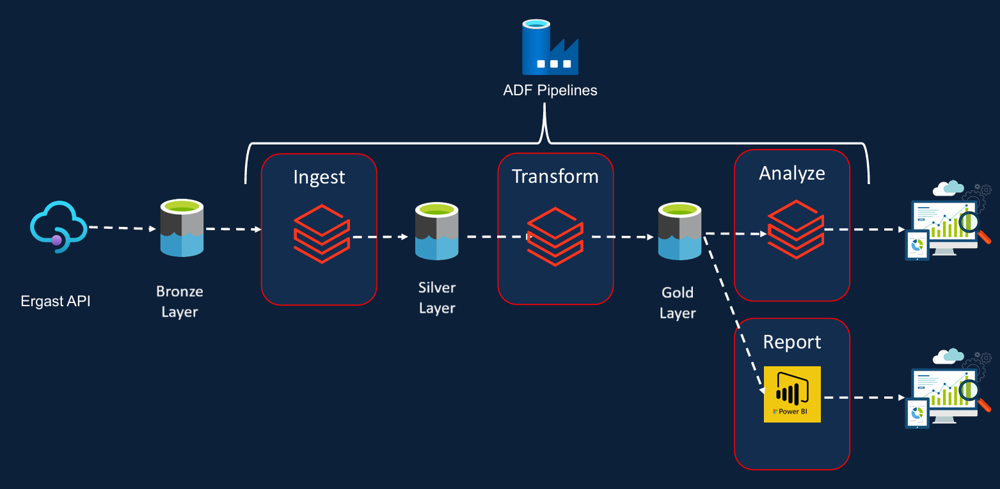

# Formula1 Project
## Project Overview

Designed and implemented an end-to-end data engineering pipeline using Azure Databricks to analyze Formula 1 race results data from 1950 to 2021. The project demonstrates enterprise-grade data processing capabilities using a medallion architecture (Bronze-Silver-Gold) to transform raw racing data into actionable analytics and insights.

This project involves:

- **Data Architecture**: Designing a Modern Data Warehouse Using Medallion Architecture **Bronze**, **Silver**, and **Gold** layers.
- **ETL Pipelines**: Extracting, transforming, and loading data from source systems into the Delta Lake.
- **Data Modeling**: Developing fact and dimension tables optimized for analytical queries.
- **Analytics & Reporting**: Creating Power BI dashboards for actionable insights.

## Data Architecture

The data architecture for this project follows Medallion Architecture **Bronze**, **Silver**, and **Gold** layers:

- **Bronze Layer**: Stores raw data as-is from the source systems. Data is ingested from CSV Files into ADLS.
- **Silver Layer**: This layer includes data cleansing, standardization, and normalization processes to prepare data for analysis.
- **Gold Layer**: Houses business-ready data modeled into a star schema required for reporting and analytics.

## Data Source
The data is sourced from the Ergest Developer API (deprecated), providing tables such as circuits, races, constructors, drivers, results, pitstops, lap times, and qualifying.

## Azure Services Used

**Azure Databricks:** For compute using Python & SQL.
**Azure Data Lake Gen2 (Delta Lake / LakeHouse):** For hierarchical storage and utilizing delta tables.
**Azure Data Factory:** For pipeline orchestration for Databricks Notebook.
**Azure Key Vault:** For storing secrets for ADLS credentials used in the Databricks Notebook.

## Project Working

### Step 1: Setting up Storage using ADLS and Containers
- Created Azure Data Lake Storage with three containers: raw, processed, presentation.
### Step 2: Setting up Compute using Databricks and connecting to Storage
- Utilized Azure Databricks with a specific cluster configuration.
- Mounted Azure Data Lake using Service Principal for secure access.
### Step 3: Ingesting Raw Data
- Ingested eight types of files and folders from the raw container.
- Created separate notebooks for ingestion and converted raw data into processed data.
### Step 4: Ingesting Processed Data
- Used processed data to perform further transformation and analysis.
- Created notebooks for race results, driver standings, constructor standings, and calculated race results.
### Step 5: Ingesting Presentation Data For Analysis
- Stored data generated from processed notebooks in the presentation container.
- Analyzed and visualized dominant drivers and teams.

## Azure Data Factory Pipeline Orchestration
### Pipelines and Trigger
- Created Ingest Pipeline, Transform Pipeline, and Process Pipeline.
- Used Azure Trigger for automation.
- Orchestration ensures automated processing of raw and processed containers.
### Azure Trigger
- Utilized tumbling window trigger for triggering based on past date data.
- Customized triggers for specific date ranges.
